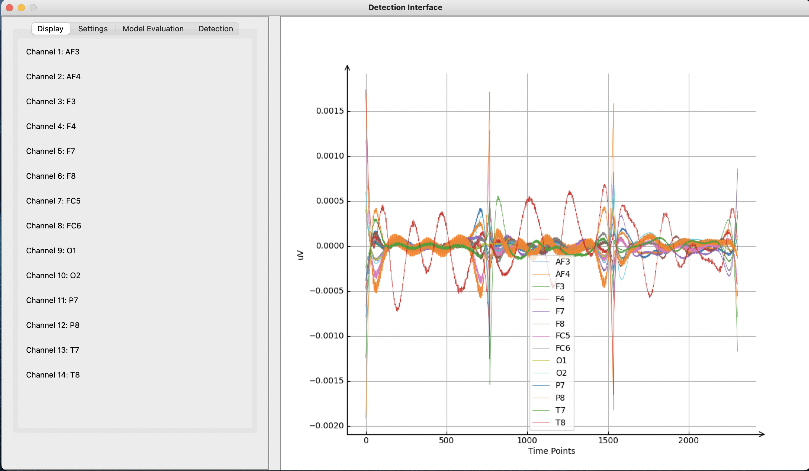
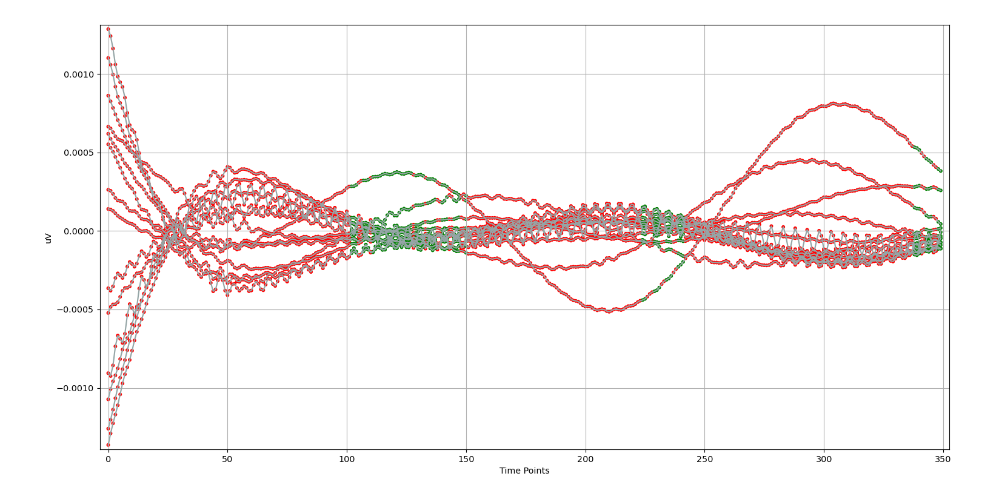

# EEG DATA ANALYSIS FOR DETECTING RELAXATION AND CONCENTRATION MOODS

This repository contains the code for the capstone project report prepared for Bahçeşehir University. 

:exclamation: Before using this project, please read the problems section first.

The project is about to analyze brain signals and classifying the relaxation and concentration moods of the 
signals by uV values over time points, by using several Machine Learning Methods. The system needs a proper data before using machine 
learning and this side will be done by the biomedical engineering students but after that Decision Tree, Naive Bayes, Random Forest, Support Vectore Classifier, 
Logistic Regression(!) methods will predict the new brain signals by software engineering students. 

Final report: [Drive](https://drive.google.com/file/d/1MimqVru68EP0wyVIlX9eh4k5CVHeSH6u/view?usp=sharing).

<p align="center"></p>


## Requirements

Python packages required (can be installed via pip or conda):

``` 
pandas
matplotlib
numpy
scikit-learn
mne
scipy
```

## Dataset

A proposed dataset can be achieved from [Drive](https://drive.google.com/drive/folders/1jxrOjBpI5nOyrV9Z9kyRgtqHT4RoYBmi?usp=sharing).
Or a desired annotated CSV file can be imported according to the proposed dataset.

After downloading, a CSV file in the folders can be selected by:
``` open edf
File > Open EDF.
```

## Models and Configurations

### Display Section
After importing a dataset, the "Display" section in the GUI application will be demonstrated as below:

<p align="center"></p>

In this page, Time points and uV figured on the right side and channels are listed on the left side.

### Settings Section

This page is a visualization of data splitting by the specified ratio of test size. 
Also assists to determine which type of classifier will be used on the data.

This will basically store the selected values in the background for "Model Evaluation" section.

### Model Evaluation

This page has only "Create and Test" button for the evaluation purposes. After pressing to this button
some common performance matrices (Accuracy, Precision, Recall, F1) and confusion matrix values will be printed.
This progress will export these values in the "Results" folder in the root folder as a TXT file and SAV
file of the model for the further purposes.

### Detection (Inference)

A SAV file that created in the previous section, can be use on this page for loading it within the 
"Load Model" button and a CSV file for the test data within the "Load Data" button. Then "Predict Data"
will be classified the dataset. At the end of the process, data can be visualized by the min and max time
on the combobox widgets.

<p align="center"></p>

According to the image above, green colors represents concentration moods and red colors represents relaxation moods.

## Problems :interrobang:
The proposed dataset was not annotated because a student was expelled from the project. Therefore, annotations in the CSV file
are generated randomly as 0 and 1. 

## Contributing :orange_heart:
This capstone project is not finished in a correct way. We started with 4 people and finished by 2 of us.
Thanks to my biomedical engineer [Bensu](https://www.researchgate.net/profile/Bensu-Sengel), who contributed to the report preparation of 
this project, which was challenging for me in those years, but which shows the development 
of the process for now.
